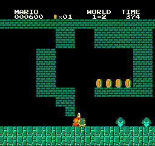

<kbd></kbd>
<kbd></kbd>
<kbd></kbd>

# Play Super Mario with Double Q Learning
This toy example of Reinforcement Learning demonstrates an implementation of Double Q-Learning to play Super Mario. [Super Mario](https://en.wikipedia.org/wiki/Super_Mario_Bros.) is an arcade game developed and released by Nintendo in 1983. I chose Mario Bros. as a replay implementation example to become familiar with reinforcement learning because [Pytorch](https://pytorch.org/tutorials/intermediate/mario_rl_tutorial.html) supplied a detailed tutorial with this implementation for a comprehensive understanding of the Double Q-learning algorithm. It simplifies environment setup, software installation, programming execution, and results tuning. The implementation here is primarily a replay of the tutorial example provied in [Pytorch](https://pytorch.org/tutorials/intermediate/mario_rl_tutorial.html).

## AI-Powered Mario Agent
Super Mario Bros. has two characters, Mario and Luigi, who work as plumbers. The game Mario Bros. includes eight worlds with a series of increasingly difficult stages in which there are different types of enemies and obstacles. Mario and Luigi's mission is to cross the obstacles on their way and defeat the enemies they met on the way to the flag in each stage. The example here will replay the implementation of the Double Q-learning algorithm using PyTorch, but it will only train one agent to play the Mario Bros. game. Thus only Mario will appear in the implementation.

## Mario Agent Setting
In the reinforcement learning framework, an agent is trained to control the character Mario in the game Mario Bros. The agent aims to navigate through Mario Bros.'s world within a proper time. The state of the game environment includes enemy positions, enemy states, obstacle positions, etc. When the agent is going through the game environment, it should avoid obstacles, defeat enemies, and ultimately complete the levels by reaching the end flag. 

The agent's actions are decided by the current state of the environment and the current action policy. For each state, Mario's agent either selects an action to explore potential strategies or exploits the neural network, which is based on previously learned information. The exploration rate gives the possibility of exploring the world or exploiting the experience information. The exploration rate is set to one as the initial condition to guarantee the agent is doing a random action at the beginning. After a while, the exploration rate will be reduced. The agent will begin to exploit by using his neural network rather than explore with random actions. The agent improves his actions (or action policy) based on the repeat learning process. 

## Architecture and Algorithm
The proposed Double Q-learning method in the paper [[1]](#1) addresses the overestimation problem from Q-learning [[2]](#2). This is achieved through the use of two independent networks, namely the Q-Network and the target Network in the implementation; see the framework pipeline below.

  

The start state is the initial state as the input $s$ of the Q-Network to predict the action $a$ that yields the highest Q-value. The Mario Bros. environment returns to the next state after the action. These two elements, along with the current state and action, are stored in a replay buffer.

During the training, a batch of data containing state, next state, reward, and done status is randomly sampled from the replay buffer. Both networks process this batch to compute their respective output values $Q^*(s,a)$ and $r+\gamma\max_{a'}Q^{**}(s',a')$, and update each other. This entire complete state action sequence constitutes an episode. To effectively train the agents to learn an optimal policy function, the process is repeated across multiple episodes.

The procedure of the algorithm is from the paper [[3]](#3), which is represented as a completed pseudocode in Algorithm.

  

For each episode, the agent repeats steps 3 to 12, and continues this over many episodes, progressively reducing $\gamma$ and refining the policy. Depending on the complexity of the game state, different architectures (e.g., Convolutional neural networks (CNNs) for image-based states, simple feed-forward networks for processed numerical states) may be required. 

## Implementation
The implementation of a Double Q-learning model here is to play the Mario world "Super Mario Bros-1-1-v0", "Super Mario Bros-1-2-v0", and "Super Mario Bros-2-3-v0" which implies the [gym-super-mario-bros library](https://pypi.org/project/gym-super-mario-bros/) based on the [OpenAI Gym](https://openai.com/index/openai-gym-beta/) developed by OpenAI, is a toolkit and library specifically designed for reinforcement learning tasks. It provides a diverse collection of environments to various reinforcement learning algorithms. In Table below, a list of the library's versions and software is implied in this implementation example.

  

To train the Double Q-learning method with the [CUDA Toolkit](https://developer.nvidia.com/cuda-toolkit) can highly reduce the time consumption.

There are eight worlds in the Mario Bros. game that can be implied by specifying any world number between 1 and 8. Each world has four stages. The difficulty of the world increases as the world number grows. The agent here trained completed the stages "1-1-v0",  "1-2-v0", and  "2-3-v0" to reach the end flags. However, training the agent for a much longer time for stage "1-2-v0" with the same conditions has not easily constructed an optimal action policy, which had trained for more than 60,000 episodes to reach the final flag. Compared to the stage "1-1-v0", the difficulty of the stage "1-2-v0" is increasing, which may result in longer training time. The training was halted at around 70,000 episodes for both world stages, yet the agent continued to show signs of improvement. While the agent demonstrated desired success in completing stage 1-1-v0, it struggled to make consistent progress in stage 1-2-v0. More training was simply needed in order to stabilize in a more complex world stage. 

In the implementation from the PyTorch tutorial, the action of the Mario agent is limited to walk right and jump right. The agent aims to finish the game by reaching the final flag but disregards collecting as many coins as possible. Each state of the environment is represented by a [3, 240, 256] size array. Indeed, there is more information included in this array than what the agent needs, such as the color of the features, the background cloud, and the texture of objects. All of the above mentioned features do not affect the actions of the Mario agent. 

## Analysis and Discussion
There are four key metrics for evaluating the performance of the Mario agent trained using reinforcement learning: Reward, Q-value, Losses, and Time Lengths of the episode as follow

  <kbd></kbd>
  

The graph shown in the lower right corner of the Figure above displays the moving average of episode lengths, where the x-axis represents the number of episodes and the y-axis represents the length of each episode. The agent has reached a consistent strategy but still experiences variability due to the game’s randomness within a new episode.
The graph in the lower left corner shows the episode average losses over time. The x-axis represents the number of episodes, and the y-axis represents the average loss. The graph shows a generally converging trend in average loss as the number of episodes progresses. The graph shown in the top right corner displays the Q-value over time, where the x-axis represents the number of episodes and the y-axis represents the Q-value. The Double Q-learning method concluded a consistent Q-value function, which corresponds to the optimal policy. The variation of the Q-value is caused by the exploration during the episode. The reward value is demonstrated in the top left corner, which displays the reward changing over the episode. The x-axis represents the number of episodes, and the y-axis represents the average reward value for each 20 episodes. The graph shows an increase in average reward as the number of episodes progresses. In the end, the reward diagram shows a tendency toward a possible convergence. 

Combining all four subgraphs, we can infer that the agent might be improving in terms of gaming efficiency but could be struggling with increasing the computational complexity. The agents must balance exploring new strategies and exploiting known strategies to maximize their overall performance.

## References
<a id="1">[1]</a>
Hasselt, Hado van and Guez, Arthur and Silver, David. 
Deep reinforcement learning with double Q-Learning. 
AAAI Press, 
Proceedings of the Thirtieth AAAI Conference on Artificial Intelligence, 
pages 2094–2100, 
Phoenix, Arizona, 
2016.

<a id="2">[2]</a>
Watkins, Christopher J. C. H. and Dayan, Peter. 
Q-Learning.
Machine Learning, 
pages 279--292, 
volume = 8, 
1992.

<a id="3">[3]</a>
Hasselt, Hado van. 
Double Q-learning. 
Curran Associates Inc, 
Proceedings of the 23rd International Conference on Neural Information Processing Systems, 
Volume 2, 
pages 2613–2621, 
Vancouver, British Columbia, Canada, 
2010.

